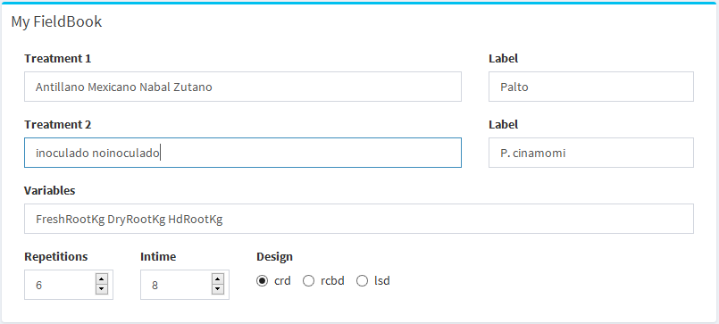
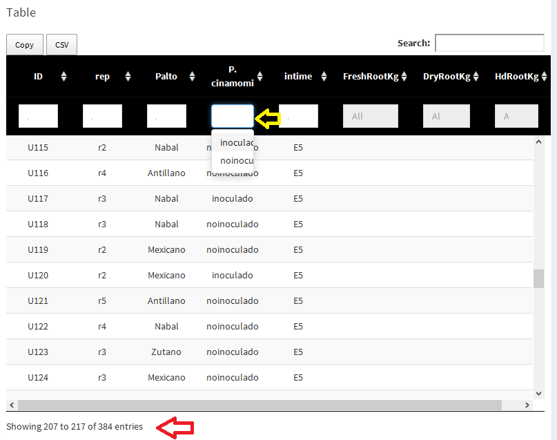
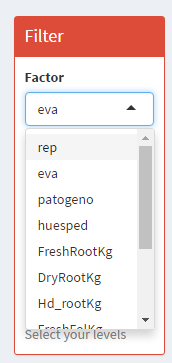
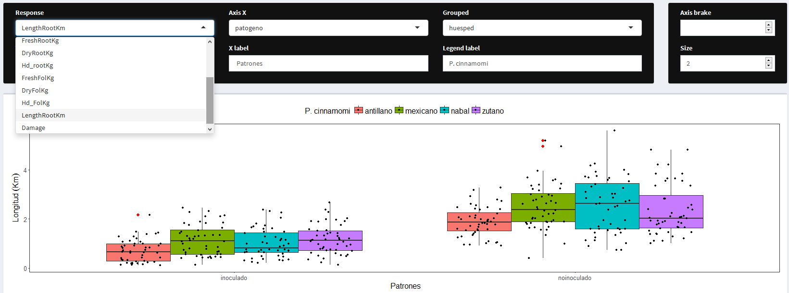
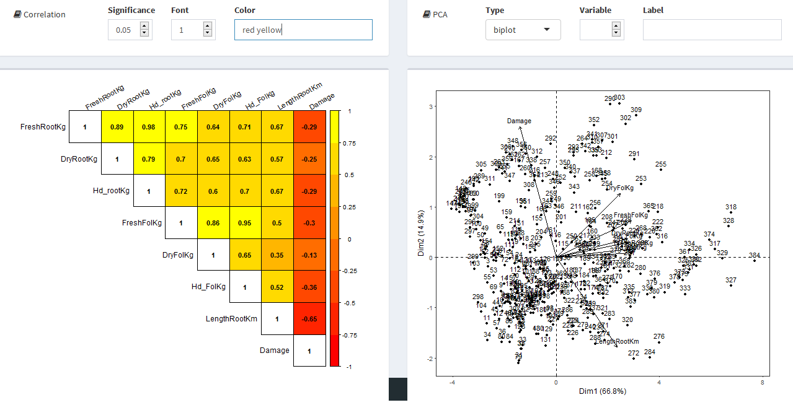
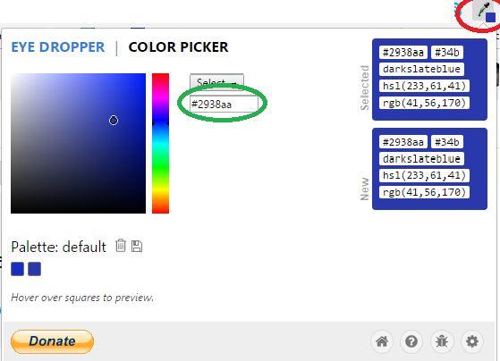
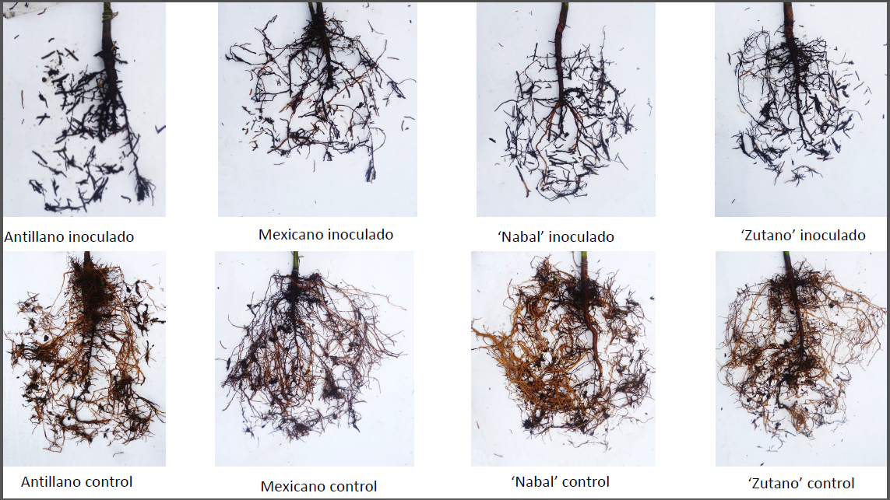
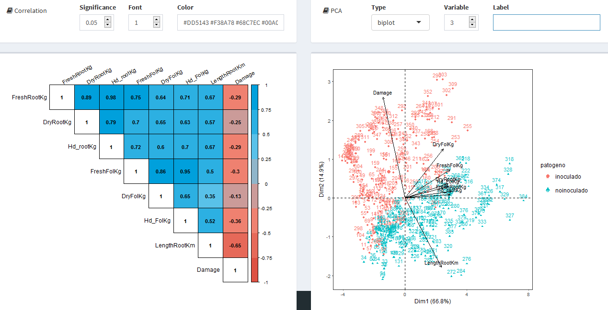
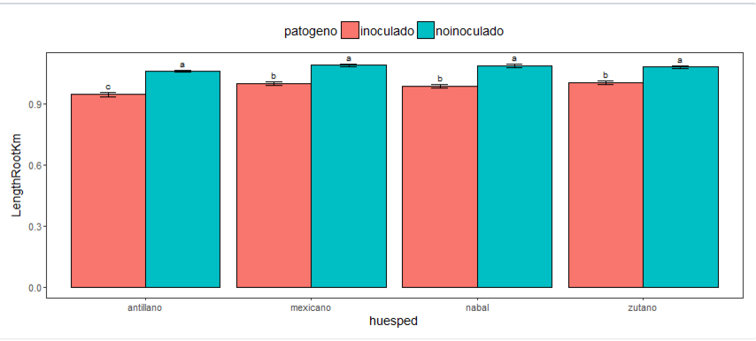

#Objective of FieldBook
_FieldBook_ es una aplicacion _online_ que busca ser una herramienta de ayuda a toda persona que este interesado en utilizar las estadisticas como herramientas cotidianas en su vida acad?mica, comercial y personal. Si esta herramienta te ayuda a reducir el tiempo en operaciones monotonas y pasar  directamente al an?lisis, la discusi?n e interpretaci?n de los resultados.

#Description scream

##Aplications

En la barra de direcciones se muestran las aplicaciones con las que cuenta _quipo.org_ en el cual puedes ingresar a la aplicacion de su interes pulsando directamente sobre el: ¡Bienvenido a FieldBook!

Para visualizar pantalla completa pulse el boton adjunto: . 

Aqui podras encontrar heramientas que te ayudara a desarrollar de manera sencilla, rapida y rigurosa tu investigación: construir un libro de campo, analisis preliminar, multivariante, comparacion de medias, contrucción de graficas y regresion.

#Tools
Cabe recaltar tener los conceptos estadisticos claros, antes de continuar debes reponder las siguintes preguntas:
¿Que es una unidad experimental?
¿Que es un factor y sub factor o niveles del factor?
¿Que es un variable?
¿Que parametros emplear?
¿Cuando usar un DCA y un DBCA?
etc..

Despues de sorter la valla de los conceptos estadisticos podrás construir tu libro de campo donde ingresaras tus factores, y niveles del factor, repeticiones, evluar en el tiempo y variables.

La primeras dificultad con la que el joven investigador se encuentra cuando pretende desarrollar un trabajo, luego de escoger el _stadistical desing_ apropiado es: 
      
      como colectar los datos.
      Como roturalo las columnas.
      Que  hacer con los datos perdidos.

Si esta es tu primera investigacion _Tools_ te sera de mucha utilidad.

##Caso practico
En el siguiente ejemplo practico Tenemos cuatro individuos de la misma especie de palto (**Treatment1**):

_Antillano_, 
_Mexicano_, 
_Nabal_, y 
_zutano_

queremos saber como se comportan a la  enfermedad  "pudricion de raiz" causado por _P. cinnamomi_. Por tanto, para este factor tenemos dos sub-factores (**Treatment2**):

_inoculado_ y 
_noinoculado_

Los hospederos de dicha enfermedad tendran la mismas condiciones ambientales y patogeno virulante. Se deses comparar como responden estos individuos a la enfermedad. Por tal razon el diseño estadistico sera un: 

  **diseño ramdomizado completamente al azar**

    cdr: Completely random design.
    rcdb: Completely randomized block design.
    lsd: Least significant difference

De dos factores: hospedero y patogeno. Ademas, debera de evaluarse en el tiempo (**8 evaluaciones**) para conocer el progreso de la enfermedad, tendra **6 repeticiones** en cada evaluacion (*6 plantas de palto*) y la variable respuesta sera:

      Weight fresh root (kg), .........FreshRootKg
      Weight dry root (Kg), ...........DryRootKg
      Weight humidity root (Kg), ......Hd_rootKg
      Weight fresh foliage (Kg), ......FreshFolKg
      Weight dry foliage (Kg), ........DryFolKg
      Weight humidity foliage (Kg), ...Hd_folKg
      Length root (Km), y..............LengthRootKm
      Damage root (%)..................Damage
      
##Tools
Con el planteamiento señalado procedemos a llenar _Tools_ 

Adicionalmente tenemos funciones como *label* el cual son los r?tulos de la columna _Treatment1_ y  _Treatment2_ respectivamente.

###Buenas pr?cticas
Al ser esta una plataforma de soporte estadistico no deja de ser riguroso con la nomenclatura y simbolos raros. Evitar ingresar simbologia extraña que **No pertenezca** al alfabeto ingles. Salvo en **label**,  el programa reconoce que haces referencia a un titulo, entonces los carateres raros solo los imprimira, mas no los analizara.

Como se aprecia, para se?alar tratamientos diferentes, se separa con espacio. En ocasiones juntamos palabras como

__noinoculado__ si por accidente separamos ambas palabras:  __no__  __inoculado__ el programa reconocer?  como dos tratamientos diferentes, _no_ e _inoculado_, otros errores comunes:

~~palto~~~~001~~     incorrecto (dos tratamientos)

~~pal?to%6""~~    incorrecto (evitar t?rminos extra?os, ???!"#$%&/()=??][{}[^)

palto_001     correcto    (un tratamiento)

Palto001      correcto   (un tratamiento)

**evitar tildes y "ñ"**

Una vez terminado de ingresar los componentes de nuestro dise?o mostrar? en **table** la libreta de campo donde podr?s _Copy_  ? imprimir en _csv_ o _xlsx_. Adicionalmente _search_ permite ingresar y ubicar un  grupos de celdas en la plantilla. Los datos seran ingresados a una hoja xlsx, de acuerdo a la plantilla.

    Aunque el programa soporta un m?nimo de dos repeticiones, se recomienda al menos tener más de tres repeticiones. Siempre existe la posibilidad de p?rdida de datos. En caso de ocurrir, mantener la plantilla tal cual y en la casilla donde corresponde el dato pérdido, dejar en blanco (nulo). No cero (0), puesto que es un valor diferente a nulo.

#FieldBook
Cuando hayas digitalizado tus datos recogidos de campo, de acuerdo a la plantilla dise?ada en _Tools_ cargaras en **FieldBook** como url ? como xlsx.

Una vez subido y actualizado el archivo. En ocaciones es muy util cargar una parte de la base de datos para un analisis parcial de bloques o factores, entonces en la herramienta **Filter** podrás filtrar la base de dato de acuerdo al criterio del investigador, tomando los factores que mejor los acerquen a sus propositos. Puede filtrar por evaluación  y algun tratamiento que sea de su particular interes.

De no escoger ningun filtro, cargara toda la base de datos a  _Outliers_.

#outliers
Aqu? se visualizan los valores at?picos, y permite al investigador tomar desiciones, como realizar una transfomaci?n de datos o suprimir valores at?picos.

Para nuestro ejemplo, en **Response** seleccionamos la variable respuesta del desplegable y al pie **Ylabel** escribiremos el r?tulo del eje de la ordenadas. 

    Aqu? se coloca el rotulo de las ordenas en cual permite  notacion cientifica y  simbolog?a no permitida siempre y cuando, vaya entre comillas (""). Ver ejemplo: Damage ("%")     escribir?      Damage (%)

Con el mismo criterio escogeremos uno de los factores (_Treatment_) en **Axis X**. Para nuestro ejemplo deseamos mostrar en el eje de las abscisas los Huespedes de la enfermedad y sobre el plano cartesiano **(Grouped)** el _patogeno_ con sus dos subfactores: _inoculado_ y _noinoculado_.

    Amarillo: Elegir la varaible respuesta que desea visulizar y su r?tulo.
    verde: Elegir el Tratamiento  a mostrar en el eje de la abscisas
    rojo: Elegir el Tratamiento  a mostrar en el plano cartesiano.  
    Azul: Elegir la escala de los ejes y el tama?o de letra.  

Adem?s en **Ylabel** y **Xlabel** permite:

    Si desea escribir: 
    La f?rmula del agua: H[2] O  
    La f?rmula de kil?metros por hora: km. Hr^{-1} 
    La concentraci?n de ?cido sulf?rico:"[" SO[4] .H[2] "]"
    *IMPORTANTE: Terminado de escribir el rotulo NO dejar espacio en blanco.

Ahora, elegimos otra variable respuesta:

Del desplegable **response** elegimos _LengthRootKm_, **Axis X** elegimos _patogeno_ y finalmente **Grouped**, _huesped_, del mismo modo debemos de cambiar los _labels_ puesto que el la imagen a?n no las hemos cambiado.

Otro forma de presentar la misma variable es la siguiente:

Qued? a criterio del invesigador la mejor manera de presentar sus datos, siempre procuparando que esta sea la m?s legible de la formas.

    Finalmente debemos precisar que para estas imagenes, hay tres puntos rojos (flecha azul) estos son los datos fuera de tipo (outliers), aumentando la desviación estandar.

#Multivariate

En  **Multivariate** tenemos dos presentaciones de las variables respuestas evaluadas. **Correlation** y **analisis de componentes principales (pca)** ambos con sus respectivos graficos. estos nos permitira reconocer la correlacion de las variables y simplificar un problema complejo, a criterio del investigador.

##correlation

En el cuadro de la izquierda **Correlation**  muestra  el grado de **Significance**, por defecto se trabaja con un grado de significancia igual al 5%, en el desplegable se puede cambiar el nivel de significancia. 

La **Correlation**  permite conocer el grado de relacion que tiene cada variable respuesta respecto a la otra, en un rango de **+1 a -1**, si el valor absoluto de la correlacion es cercano a **1** indica que presenta una _magnitud_ relación muy estrecha, y el signo es positivo o negativo indica que es una relación directa o inversa, respectivamente.

En **Font** se puede escoger el tamaño de fuente, el cual por defecto es **1** es el tamaño de fuente más apropiado si se desea copiar la imagen para imprimir. Por último, **color**, en este se colocaran los colores HTML de su preferencia separados por un espacio para representar dicha correlacion, notar que el orden como se ingresan los codigos de colores HTML es importante. 

###colors HTML
Para un mejor empleo de los colores HTML en **Multivariate**, se debera colocar los **colores HTML** o llamar a los  colores primarios por su nombre, como: _yellow_  _red_  _green_  _blue_  _orange_ _black_ _gray_ _white_. 

Una forma practica de obtener el codigo es usando un **eyes dropper**, una vez instalado en su navegador, ingresar al **color picker**. Copiar el codigo del color y pegar sobre **Multivariate - correlation - color**, como se muestran en los circulos.

Copiado el codigo de color HTML, pegar en **Multivariate - correlation - color**.

Es asi como puede personalizar sus graficos de la **Correlation**.

##Analisis de componentes principales

En el analisis de los componentes principales (PCA), se tiene el desplegable **Type** donde se presenta _biplot_, _var_ e _ind_; y junto a **Variable**, se puede escoger el plano que mejor grafique el proposito del investigador, con la combinacion de estos.

**PCA- Type** permite encoger _var_  el que representa la correlacion de las variables respuestas en una grafica simple  de radio = **1**. El cual tienen el mismo marco conceptual que **Corretation** visto lineas arribas, pero en esta ocacion en una representación grafica.

La variable respuestas poseen una _magnitud_ y _direccion_ respecto a los cuadrantes del plano cartesiano.

    Para el ejemplo observamos que se mueven una dirección opuesta (relacion inversa) y magnitud cercano a cercana a "1" (una correlaciin alta) entre Damage y LengthRootKm. Al investigador le interesan particularmente estas dos variables, puesto se esta estudiando la damage que causa un patogeno a las raices, es prioritario centrar su atención sobre los sintomas primarios (el deterioro de la raices).  

En la herramienta  **Tools** se construyo la libreta de campo y el orden como se contruye la columna: repetecion, bloque, factores y variables, es importante a la hora de escoger en   **Multivariate - PCA - Variable**,la columna que vas a representar.

    Para el ejemplo, cuando elegimos en varible 2, elegimos  la columna 2, que   representa a las evaluaciones por lo que en la leyenda iran las evaluaciones con su respectivo color, y en label, tiene la oportunidad de cambiar el rotulo de la columna, puede cambiar eva  por Evaluacion.

      Dando sobre el desplegable "Varaible"", hasta la  columna 3, el que representa  al  patogeno   por consecuencia aparece como rotulo en la leyenda, y se puede apreciar que en la grafica se separa la columna  patogeno (inoculado    y   noinoculado). Si deseamos cambiar el rotulo de la leyenda, escribir en "Label" el nombre de su preferencia.  

Es criterio del investigador tomar la columna que mejor se ajuste a sus necesidades.

El eje de las componentes principales representa el _porcentaje de variabilidad de la varianza_ y no tiene otro significado del que le da el investigador.

#Stadistic

Esta es un plataforma de calculos estadistístico, reposa sobre el investigador su correcto uso.

En **Response** seleccionamos la variable respuesta que deseamos analizar.

En **Block** dependiendo del stadistical desing seleccionar el bloque, o del criterio del investigador alguna columna que quiera aislar de manera particular.

En **Factors** seleccionar el los tratamientos o factores.

En **Significance** esta predefinido con un nivel de significancia del 5%, pero este también queda a criterio del investigador.

En **Type** se presenta el tipo de prueba: _Tukey_, _Duncan_ y _Snk (Student Newman Keuls)_
          

    Para nuestro ejemplo, segun la prueba de Tukey, existen diferencias estadisticamente significativas, entre evaluaciones, entre huespedes (individuos evaluados), y entre el factor patogeno (inoculado y noinoculado).
    Y, No existe diferencias estadisticamente significativas cuando interatuan los factores (huesped:patogeno). Es decir, cuando se tomo cada bloque (cada evaluacion) no existe una respuesta significativa de los  hospederos  con respecto a la presencia o ausenica del patogeno. 
     Cuando se evaluo la interacción, No se encontro evidencias estadisticamente significativas. Y esto, resulta beneficioso, pues de ser significativo se hubiera negado la validez de los factores analizados.

#Graphics

#Regression

